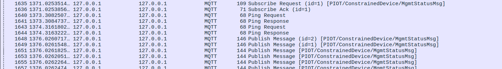

# Constrained Device Application (Connected Devices)

## Lab Module 06

Be sure to implement all the PIOT-CDA-* issues (requirements) listed.

### Description

NOTE: Include two full paragraphs describing your implementation approach by answering the questions listed below.

What does your implementation do? 

The GDA (Generic Data Agent) is now capable of securely and asynchronously processing incoming data from the CDA (Central Data Agent).

How does your implementation work?

This enhanced functionality is achieved by:

    Replacing MqttClient with MqttAsyncClient to enable asynchronous operations.
    Consequently adapting the MqttClientConnector to accommodate this change.
    Incorporating encryption into the communication channel.
    Utilizing listeners with IMqttMessageListener for efficient message handling

### Code Repository and Branch

NOTE: Be sure to include the branch.

URL: https://github.com/LucachuTW/PIC-Python-components/tree/labmodule06

### Unit Tests Executed

NOTE: The instructor will execute your unit tests. You only need to list each test case below
(e.g. ConfigUtilTest, DataUtilTest, etc). Be sure to include all previous tests, too,
since you need to ensure you haven't introduced regressions.

- 
- 
- 

### Integration Tests Executed

NOTE: The instructor will execute most of your integration tests using their own environment, with
some exceptions (such as your cloud connectivity tests). In such cases, they'll review
your code to ensure it's correct. As for the tests you execute, you only need to list each
test case below (e.g. SensorSimAdapterManagerTest, DeviceDataManagerTest, etc.)

- MqttClientConnectorTest
- MqttClientControlPacketTest
- 

EOF.
