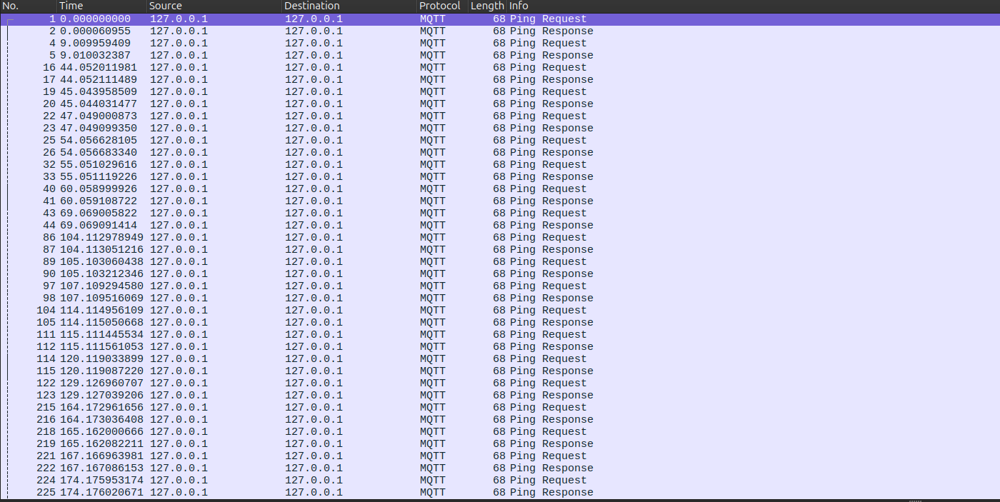

# Gateway Device Application (Connected Devices)

## Lab Module 07

Be sure to implement all the PIOT-GDA-* issues (requirements) listed.

### Description

NOTE: Include two full paragraphs describing your implementation approach by answering the questions listed below.

What does your implementation do?

With this update, the GDA can now also engage with MQTT topics through subscriptions, empowering it to consume incoming data streams or dispatch its own messages using this communication method.

How does your implementation work?

Underpinning this, the Paho library manages the core aspects of MQTT communication, including publish/subscribe patterns and connection establishment. To ensure its correct functionality, Wireshark was once again utilized for observing network traffic.

### Code Repository and Branch

NOTE: Be sure to include the branch.

URL: https://github.com/LucachuTW/PIC-Java-components/tree/labmodule07

### Unit Tests Executed

NOTE: The instructor will execute your unit tests. You only need to list each test case below
(e.g. ConfigUtilTest, DataUtilTest, etc). Be sure to include all previous tests, too,
since you need to ensure you haven't introduced regressions.

- 
- 
- 

### Integration Tests Executed

NOTE: The instructor will execute most of your integration tests using their own environment, with
some exceptions (such as your cloud connectivity tests). In such cases, they'll review
your code to ensure it's correct. As for the tests you execute, you only need to list each
test case below (e.g. SensorSimAdapterManagerTest, DeviceDataManagerTest, etc.)

- MqttClientConnectorTest
- MqttClientCOntrolPAcketTest
- 

EOF.
