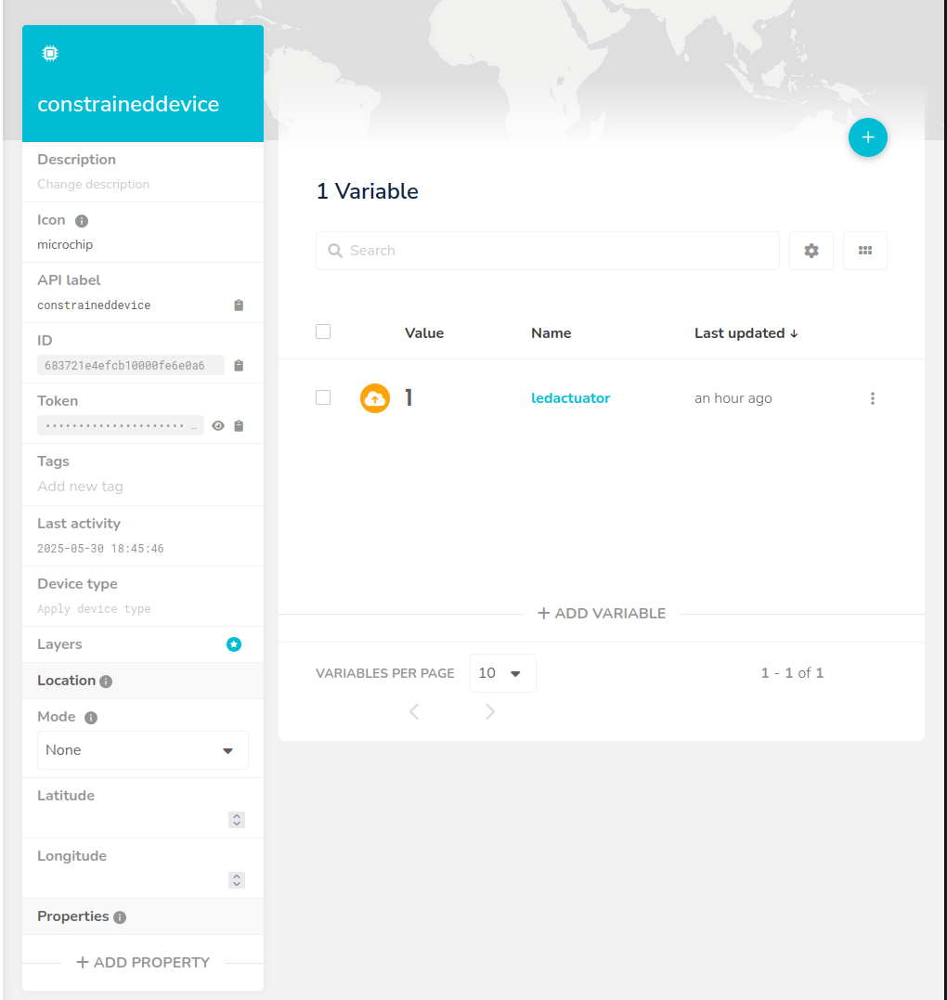
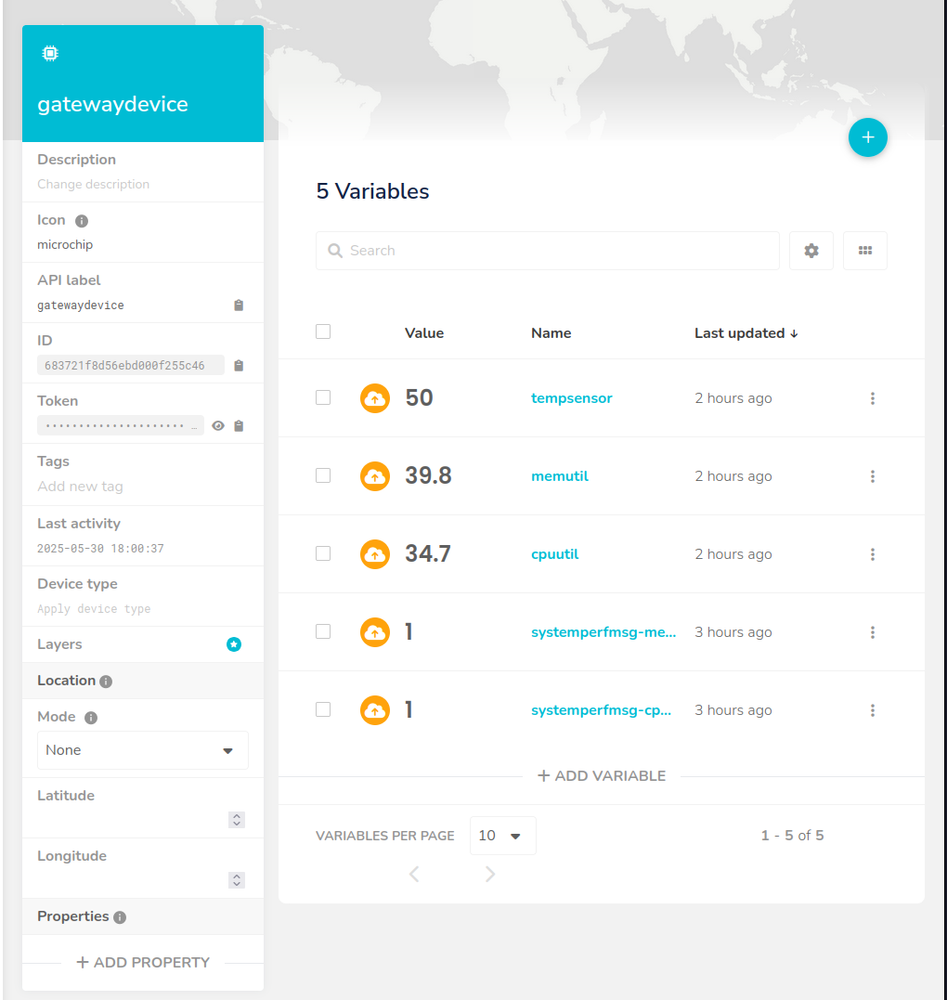

# Gateway Device Application (Connected Devices)

## Lab Module 11

Be sure to implement all the PIOT-GDA-* issues (requirements) listed.

### Description

NOTE: Include two full paragraphs describing your implementation approach by answering the questions listed below.

What does your implementation do?

The current implementation enables the GDA to upload data received via MQTT to the Ubidots cloud platform. This uploaded information includes sensor data, PC resource utilization, and the status of the LED actuator.

How does your implementation work?

The MqttClientConnector component establishes a connection with the Ubidots cloud by utilizing the required credentials and certificates. It then proceeds to publish the data to specific devices and topics within the Ubidots environment.

### Code Repository and Branch

NOTE: Be sure to include the branch.

URL: https://github.com/LucachuTW/PIC-Java-components/tree/labmodule11

### Unit Tests Executed

NOTE: The instructor will execute your unit tests. You only need to list each test case below
(e.g. ConfigUtilTest, DataUtilTest, etc). Be sure to include all previous tests, too,
since you need to ensure you haven't introduced regressions.

- 
- 
- 

### Integration Tests Executed

NOTE: The instructor will execute most of your integration tests using their own environment, with
some exceptions (such as your cloud connectivity tests). In such cases, they'll review
your code to ensure it's correct. As for the tests you execute, you only need to list each
test case below (e.g. SensorSimAdapterManagerTest, DeviceDataManagerTest, etc.)

- CloudClientConnectorTest
- MqttClientConnectorTest

EOF.
