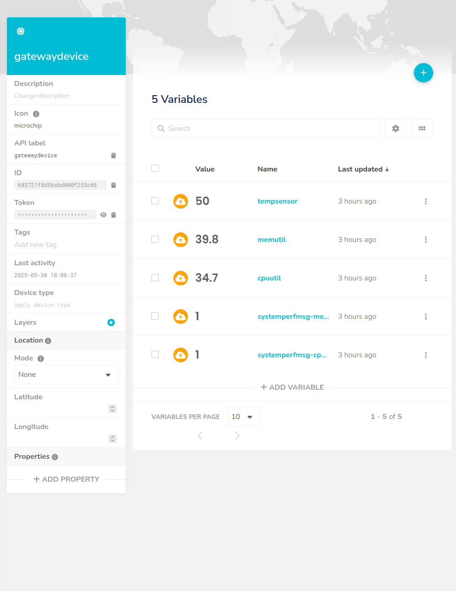

# Lab Module 12 - Semester Project - Final Write-up

NOTE: Be sure to implement all the Lab Module 12 requirements listed at Lab Module 12.

## Description

My idea was to add a light sensor and an LED display to an IoT system. The new sensor measures ambient light, and the LED display provides direct visual information or feedback.

## What - The Problem

The problem was that the system couldn't detect light levels or show simple visual updates. This matters because sensing light allows for smarter actions, like adjusting lighting for energy saving, and visual updates make it easier to see what the system is doing.

## Why - Who Cares?

I care about this because I wanted to make the IoT system more interactive and responsive to its environment. It’s a practical way to show how devices can sense their surroundings and communicate information clearly.

## How - Expected Technical Approach

I added a new light sensor and an LED display. Code was created for these parts, allowing the sensor to gather light data and send it using MQTT. The LED display can now show this data or other system statuses, providing visual feedback.

### System Diagram

Embed a block diagram depicting your overall design, including the CDA, GDA, and Cloud Services interactions.
Be sure to include arrows depicting data flow from one application / service to the next.

CDA <-> GDA <-> UbiDots Cloud

Write 1 to 2 paragraphs describing your design.

### What THREE (3) sensors and ONE (1) actuator did you use (add more if you wish)?

- CDA Sensor 1: Temperatura

- CDA Sensor 2: Humedad

- CDA Sensor 3: Presioón

- CDA Sensor 4: Luminosidad

- CDA Actuator 1: Led

### What ONE (1) CDA protocol and TWO (2) GDA protocols did you implement (add more if you wish)?

- CDA to GDA Protocol: MQTT

- GDA to CDA Protocol: MQTT

- GDA to Cloud Protocol: MQTT

- Cloud to GDA Protocol: MQTT

 
### What TWO (2) cloud services / capabilities did you use (add more if you wish)?

- Cloud Service 1 (data ingress - all inputs):

- Cloud Service 2 (data egress - all actuation events):

## Screen Shots Representing Cloud Services

### Screen Shots Representing Visualized Data

NOTE: Include (at least) TWO (2) screen shots - one showing at least 1 hour
of time-series data from the CDA, and one showing an event being triggered
that results in an actuation event sent to your GDA and then to your CDA.

Could not do it

EOF.
